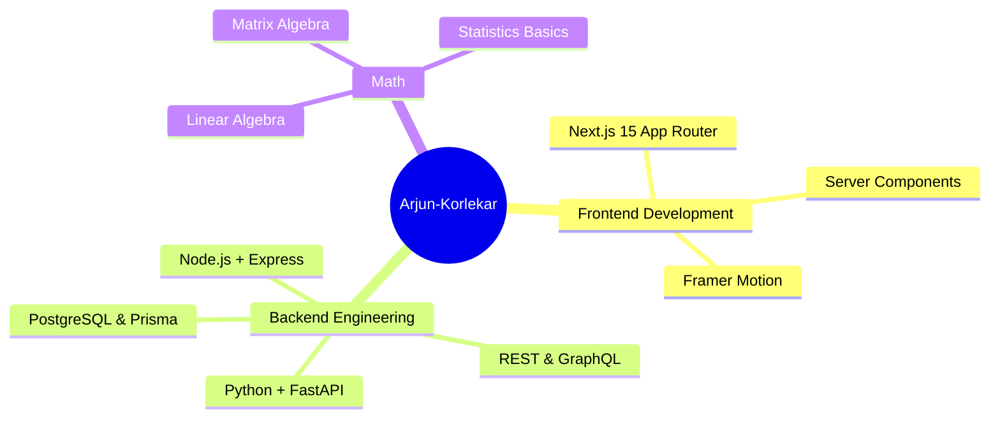
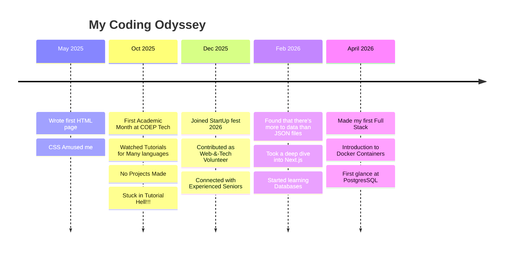

# 🚀 Arjun Korlekar's GitHub Hub 🚀


  


---

## 🧬 `$ whoami`

> A first‑year engineering student at COEP Technological University,
> obsessed with how computers really work, from transistors to TypeScript.
> I breathe pure curiosity !


I'm a **19‑year‑old builder** who never settles for *"it works"*. When I'm not pushing pixels with **Next.js** and **Tailwind**, I'm likely diving into **Backend** , learning how **databases** handle concurrency under the hood. My journey is equal parts **web craftsmanship** and **algorithmic problem‑solving**.

At **COEP Technological University** – one of India's oldest and most prestigious engineering institutes – I'm surrounded by a culture of innovation, and I'm making every semester count. I believe that with enough Ambition and **Consistency** , one can achieve anything in the universe.

---

## 🎯 **Current Focus & Learning Pipeline**


---

## 🧰 **Tech Arsenal – The Tools I Speak (For now , Caveman)**

### 🌐 Frontend


### ⚙️ Backend & APIs


### 🗄️ Databases & ORMs


### 🔧 Tools & Platforms


---

## 📊 **GitHub Analytics – Proof of Consistency**


)


---

## 🕰️ **The Journey So Far – From `Hello World` to Production Code**



### 📖 My Learning Philosophy

- **Learn in public** – Every bug fix, every new concept will soon go into a blog post or a Twitter thread. Teaching cements knowledge.
- **Build to learn, not learn to build** – This is something the "Tutorial Hell" taught me. Now i brainstorm on a common problem , or even a problem that perhaps only i face , discuss it with open source thinking models to select tech stack , and start building right away while learning!
- **Unmanaged time is the enemy** – Procrastination , burnout and other similar modern terms are a a sorry excuse for slacking !

---

## 🏗️ **Projects – Not Just Tutorials, But Real Code**

*Each one is documented and tested. Dive into the repos!*

### 🧠 Synapse - Personal Knowledge Management App


**Stack:** Next.Js , FastAPI , PostgresSQL , Docker  

A Graph-Based Personal Knowledge Management System for Engineers

Transform fragmented notes into an interconnected semantic network. Built for deep learners who think in connections, not folders.

[](https://github.com/SkyArjun99/synapse)

### 🎨 Portfolio 2.0


**Stack:** Next.js 15 

My digital garden with interactive 3D elements, blog, and live code sandboxes. Designed to be a "tech resume that runs in a browser".

[](https://github.com/SkyArjun99/SkyArjun99)  

---

## 💻 **Dev Setup & Vibes**

*What powers my 4 a.m. coding sessions?*

```yaml
OS:        Arch Linux 
Shell:     zsh + oh‑my‑zsh + powerlevel10k
Editor:    VS Code with nightly theme & vim keybindings
Terminal:  Konsole
Hardware:
  Laptop:  HP Laptop 14 (Integrated Graphics, 8 GB RAM)
  Monitor: LG 33" 2K ( TV )
  Keyboard: Dell KB212-B
  Mouse:    Zebronics Wireless

```


---

## 🧘 **Quotes That Keep Me Going**

> *"First, solve the problem. Then, write the code."* – John Johnson  
> *"Any fool can write code that a computer can understand. Good programmers write code that humans can understand."* – Martin Fowler  
> *"Make it work, make it right, make it fast."* – Kent Beck

And my own:

> *"Your GitHub profile is your resume in a world that values proof over promises. Keep it green, keep it honest."*

---

## 📬 **Let's Connect! I'm Always Open to Interesting Conversations**

[](https://linkedin.com/in/arjun142235351)  
[](https://twitter.com/your-twitter)  
[](mailto:arjunkorlekar51@gmail.com)  
[](https://your-portfolio.vercel.app)  
[](https://discord.gg/your-invite)

---


*"Code is like humor. When you have to explain it, it's bad."* – Cory House

*🧠 Generated with love, Markdown, and a sprinkle of humor • Last updated: soon via GitHub Action*